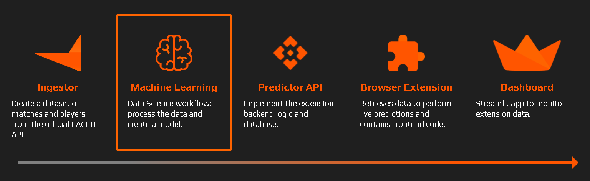
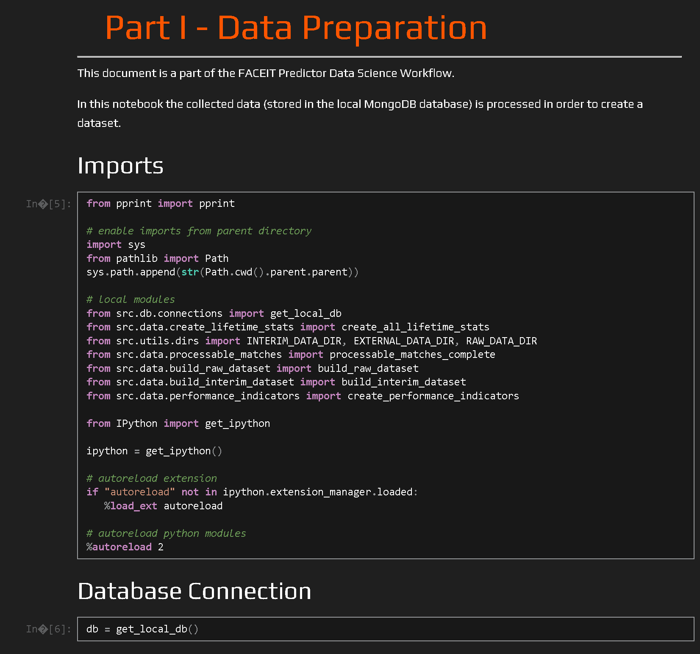

# FACEIT Predictor - Machine Learning

This repository is a part of the FACEIT Predictor project and covers the development of the Machine Learning model to be used in the browser extension. The model predicts the outcome of Counter Strike Global Offensive matches played on the FACEIT platform.

Install the chrome extension:

*Disclaimer: FACEIT Predictor is a third-party browser extension and not affiliated with FACEIT.*

## Overview

[**Counter Strike: Global Offensive (CS:GO)**](https://store.steampowered.com/app/730/CounterStrike_Global_Offensive/) is a 5v5 tactical First Person Shooter developed by Valve and Hidden Path Entertainment. The game has a lively esports scene and millions of monthly active users, playing not only on the official in-game matchmaking but also on external platforms.

[**FACEIT**](https://www.faceit.com/en) is a leading independent competitive gaming platform for online multiplayer games. Nowadays FACEIT draws a huge portion of CS GO players, esports organizers and communities due to an enhanced gaming experience.

The development of FACEIT Predictor encompasses five stages as described below.

The Machine Learning/Data Science consists of the development of two models: **Complete** & **Simplified**. The first one takes into account the data from players' previous matches, while the second one doesn't.

<!-- # Introduction
[**Counter Strike: Global Offensive (CS:GO)**](https://store.steampowered.com/app/730/CounterStrike_Global_Offensive/) is a multiplayer tactical first-person shooter developed by Valve and Hidden Path Entertainment released in August 2012. The game has a lively esports scene and millions of monthly active players, continuing the legacy of the previous iterations of the franchise. Teams compete in professional leagues and tournaments, and Global Offensive is now one of the largest global esports.

Competitive mode, the primary gameplay mode, pits two teams (Terrorists and Counter-Terrorists) of five players against each other in a best-of-30 round match. The Steam platform is responsible for managing the in-game matchmaking. There are also other platforms that offer high standards for playing CS:GO such as ESEA, FACEIT, Esportal.

[**FACEIT**](https://www.faceit.com/en) is a leading independent competitive gaming platform for online multiplayer games. Esports organizers, players and communities use FACEIT to create and manage online competitions. Nowadays FACEIT draws a huge portion of CS GO players. It provides an enhanced gaming experience mainly through reliable and well configured game servers as well as an effective protection versus cheaters.  -->

# Notebooks
Use the links below to properly view the notebooks.
<table border="2">
 <tr>
    <th>Complete</td>
    <th>Simplified</td>
 </tr>
 <tr>
    <td><ol>
  <li>
    <a href="https://htmlpreview.github.io/?https://github.com/henriquebferreira/faceit-predictor-ML/blob/master/complete/reports/01_data_preparation.html">Data Preparation</a>
  </li>
  <li>
    <a href="https://htmlpreview.github.io/?https://github.com/henriquebferreira/faceit-predictor-ML/blob/master/complete/reports/02_eda.html">Exploratory Data Analysis</a>
  </li>
  <li>
    <a href="https://htmlpreview.github.io/?https://github.com/henriquebferreira/faceit-predictor-ML/blob/master/complete/reports/03_feature_engineering.html">Feature Engineering</a>
  </li>
  <li>
    <a href="https://htmlpreview.github.io/?https://github.com/henriquebferreira/faceit-predictor-ML/blob/master/complete/reports/04_feature_viz.html">Data (Features) Visualization</a>
  </li>
  <li>
    <a href="https://htmlpreview.github.io/?https://github.com/henriquebferreira/faceit-predictor-ML/blob/master/complete/reports/05_modelling.html">Modelling</a>
  </li>
</ol></td>
    <td><ol>
    <li>
    <a href="https://htmlpreview.github.io/?https://github.com/henriquebferreira/faceit-predictor-ML/blob/master/simplified/reports/01_data_preparation.html">Data Preparation</a>
  </li>
  <li>
  -
  </li>
  <li>
    <a href="https://htmlpreview.github.io/?https://github.com/henriquebferreira/faceit-predictor-ML/blob/master/simplified/reports/03_feature_engineering.html">Feature Engineering</a>
  </li>
  <li>
    <a href="https://htmlpreview.github.io/?https://github.com/henriquebferreira/faceit-predictor-ML/blob/master/simplified/reports/04_feature_viz.html">Data (Features) Visualization</a>
  </li>
  <li>
    <a href="https://htmlpreview.github.io/?https://github.com/henriquebferreira/faceit-predictor-ML/blob/master/simplified/reports/05_modelling.html">Modelling</a>
  </li>
</ol></td>
 </tr>
</table>

*Notebook Preview*

# Related Repositories 

* [FACEIT Ingestor (Private)](https://github.com/henriquebferreira/faceit-ingestor)
* [FACEIT Predictor API (Private)](https://github.com/henriquebferreira/faceit-predictor-api)
* [FACEIT Predictor Browser Extension(Private)](https://github.com/henriquebferreira/faceit-predictor-extension)
* [FACEIT Predictor Dashboard](https://github.com/henriquebferreira/faceit-predictor-dashboard)

# License

 FACEIT Predictor by Henrique Ferreira is licensed under a <a rel="license" href="https://creativecommons.org/licenses/by-nc/4.0/">Creative Commons Attribution-NonCommercial 4.0 International (CC BY-NC 4.0) License </a>